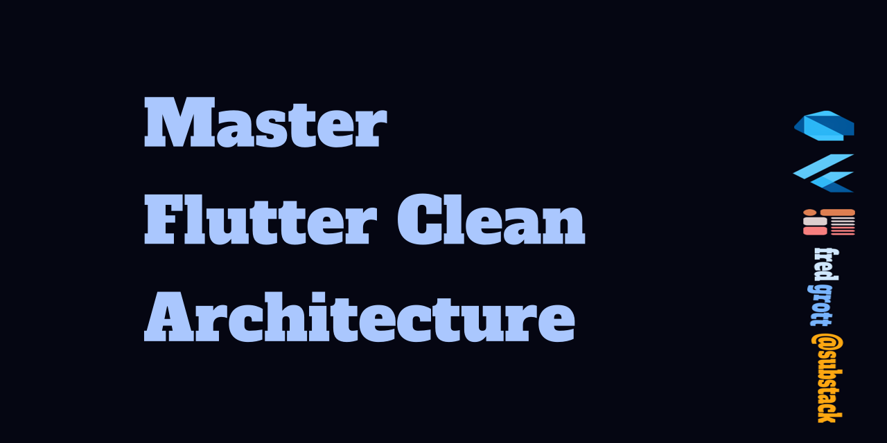

# Master Clean Arch

Dart, the computer language that powers the Flutter framework, uses a mixed OOP and functional approach to modeling using algebraic data types.

But with major changes towards this in Dart 3.x rom Dart 2.x many of you are still not using that power to make more concise domain and data layers of your clean arch app approach.

This repo offers lessons in how to accomplish those feats. And, yes in  2025 when meta static programming fully shows up will be addressing that as well.

## Layers

### Domain

### Data

## Articles

My aricles can be found at my flutter substack:

[Fred Grott's Flutter substack](https://fredgrott.substack.com)

